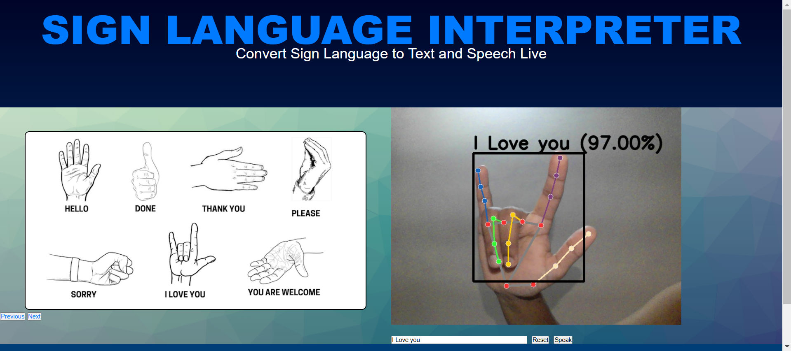

# Real-Time Sign Language Interpreter ✋🗣️

A web-based application that interprets American Sign Language (ASL) gestures in real-time using Computer Vision and Machine Learning. The system translates hand gestures into text and speech, facilitating communication for the hearing and speech impaired.

<p align="center">
  
  
</p>

## 🌟 Features
* **Real-Time Detection:** Uses MediaPipe to detect hand landmarks and Random Forest for classification.
* **Web Interface:** Built with Flask and SocketIO for low-latency video streaming and feedback.
* **Speech Output:** Converts the predicted text into spoken audio.
* **33 Supported Classes:** Detects the full alphabet (A-Z) plus common phrases like "Hello," "I Love You," "Thank You," and "Please".

## 🛠️ Tech Stack
* **Python 3.x**
* **OpenCV:** For image processing and video capture.
* **MediaPipe:** For robust hand landmark detection.
* **Scikit-Learn:** Implements the Random Forest Classifier.
* **Flask & Flask-SocketIO:** Backend web server and real-time communication.

## 📂 Project Structure
* `static/`: Contains images used in the web interface (ASL Charts).
* `assets/`: Contains project screenshots for documentation.
* `app.py`: The main Flask application that runs the web interface and handles inference.
* `train_classifier.py`: Script to train the Random Forest model using the collected dataset.
* `create_dataset.py`: Converts raw images into a pickle dataset of landmarks.
* `collect_imgs.py`: Utility script to capture new sign language data via webcam.
* `inference_classifier.py`: A standalone script to test detection without the web UI.

## 🚀 Installation & Run

1.  **Clone the repository:**
    ```bash
    git clone [https://github.com/YOUR_USERNAME/Sign-Language-Interpreter.git](https://github.com/YOUR_USERNAME/Sign-Language-Interpreter.git)
    cd Sign-Language-Interpreter
    ```

2.  **Install Dependencies:**
    ```bash
    pip install -r requirements.txt
    ```

3.  **Run the Application:**
    ```bash
    python app.py
    ```
    Open your browser and navigate to `http://127.0.0.1:5000`.

## 📊 Dataset & Training (Optional)
If you wish to retrain the model with your own gestures:

1.  **Collect Data:** Run `python collect_imgs.py` and press 'Q' to capture images for each class.
2.  **Process Data:** Run `python create_dataset.py` to convert images into landmark data.
3.  **Train Model:** Run `python train_classifier.py` to generate the `model.p` file.

## 📷 Gestures Supported
The model is trained on the standard ASL alphabet and specific phrases:


* **Alphabet:** A-Z
* **Phrases:** Hello, Done, Thank You, I Love You, Sorry, Please, You are welcome.